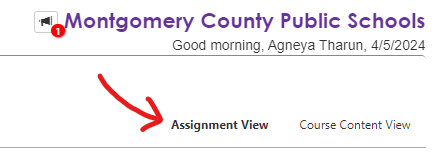

<div align="center">
  <h1>GradeFelon</h1>
</div>

Having a grade management system as bad as Synergy's StudentVUE should be a felony. Use this API-less chrome extension to calculate your grade, add assignments, and change the scores to assignments.

**This is a third party, unofficial tool. Grade Felon is not affiliated with this company in any way, shape, or form. StudentVUE is a registered trademark owned by Edupoint.**

## Quick Start
Download the extension
```
git clone https://github.com/Vort3xed/GradeFelon.git
```
Travel to `chrome://extensions/` and enable developer mode. Click on `Load Unpacked` and select the `GradeFelon` folder.
You should now see the GradeFelon extension in your extensions bar. 

## Usage
Travel to `https://md-mcps-psv.edupoint.com/PXP2_LaunchPad.aspx` and click on grade book. Then, click on the class you'd like to look at and make sure you click on the **assignment view** button:



Now that you're in the assignment view, you are able to use the provided tools at the top right of the page. GradeFelon can only be used on the assignment view page.

## Features
Currently the tool only has functionality to scrape assignments from the webpage and allow you to add assignments and see your score after. I will add functionality to change the scores of assignments and add more assignments in the very near future. Many more features are planned to be added in the near future!

## Important
GradeFelon was created to act as a permanent solution for the allowing students to change, add, and view their grades. GradeFelon does not use any API requests to retrieve student information and only does so by scraping the webpage. Student information is secure and only stored on the client side. Passwords and IDs are not stored by GradeFelon.

---

Created by Agneya Tharun (PHS '25)

If you were wondering, yes, the name of this project draws inspiration from [Grade Melon](https://github.com/tinuh/grade-melon)